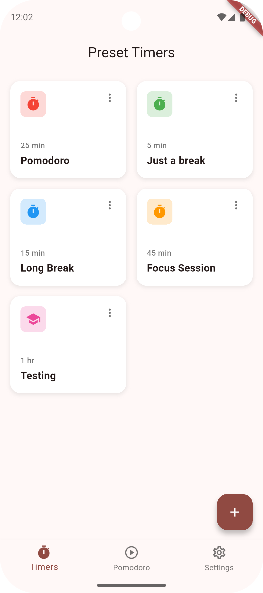
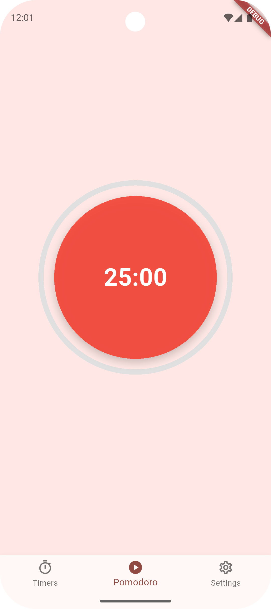

# Pomodoro Timer

This Pomodoro Timer app helps you work smarter by breaking your day into focused sessions and refreshing breaks.

Set a task, start a timer, and let the app guide you through proven Pomodoro cycles that boost concentration and reduce procrastination. With a clean, distraction-free design, customizable work and break lengths, and gentle reminders to pause and reset, it’s perfect for studying, coding, writing, or tackling your to-do list. One timer, better focus, real progress—25 minutes at a time. 🍅⏱️

## Features

- 🎯 **Multiple Custom Timers**: Create and manage unlimited timer presets with custom names, durations, colors, and icons
- 📊 **Visual Progress Tracking**: Beautiful circular progress indicator showing timer countdown
- 💾 **Persistent Storage**: All timers saved locally with SQLite database
- 🔔 **Sound & Vibration Notifications**: Customizable alerts for timer completion
- 🎨 **Modern Material Design 3 UI**: Clean, intuitive interface with smooth navigation

## Screenshots

  
  

The app features three main screens:
1. **Timers Screen**: View and manage all your timer presets in a grid layout
2. **Pomodoro Screen**: The main timer interface with circular progress indicator
3. **Settings Screen**: Configure app preferences and view app information

## Requirements

- Flutter SDK: ^3.9.0
- Dart SDK: Compatible with Flutter 3.9.0
- Android: Minimum SDK version as specified in `android/app/build.gradle.kts`
- iOS: Compatible with iOS deployment target as specified in `ios/Runner.xcodeproj`

## License

This project is licensed under the Apache License 2.0 - see the [LICENSE](LICENSE) file for details.
